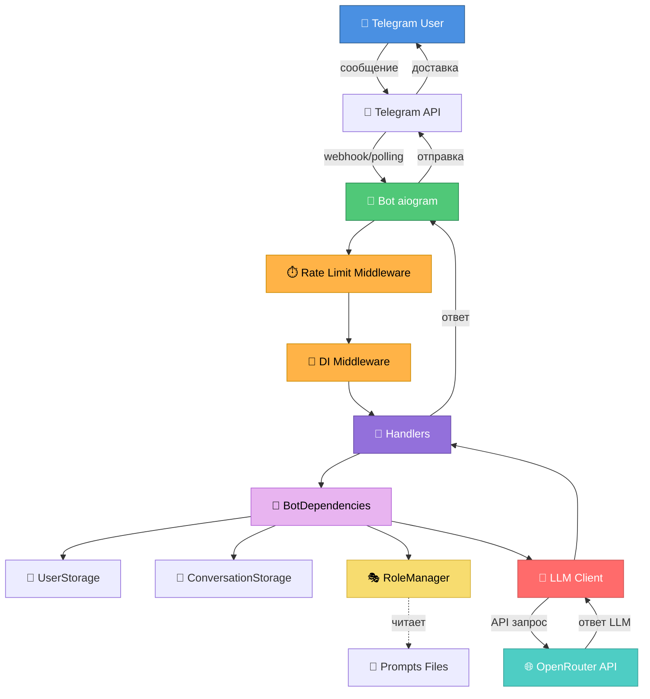
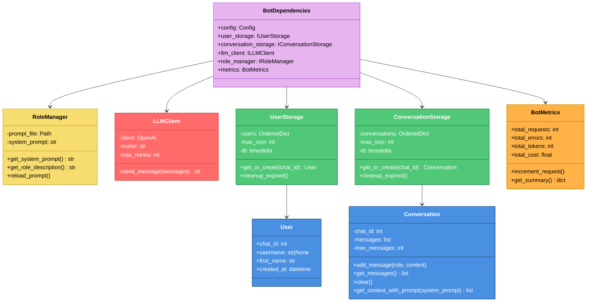
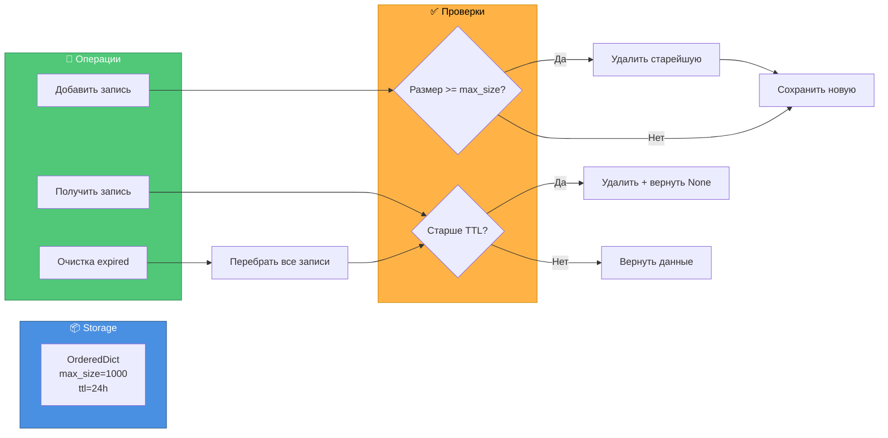
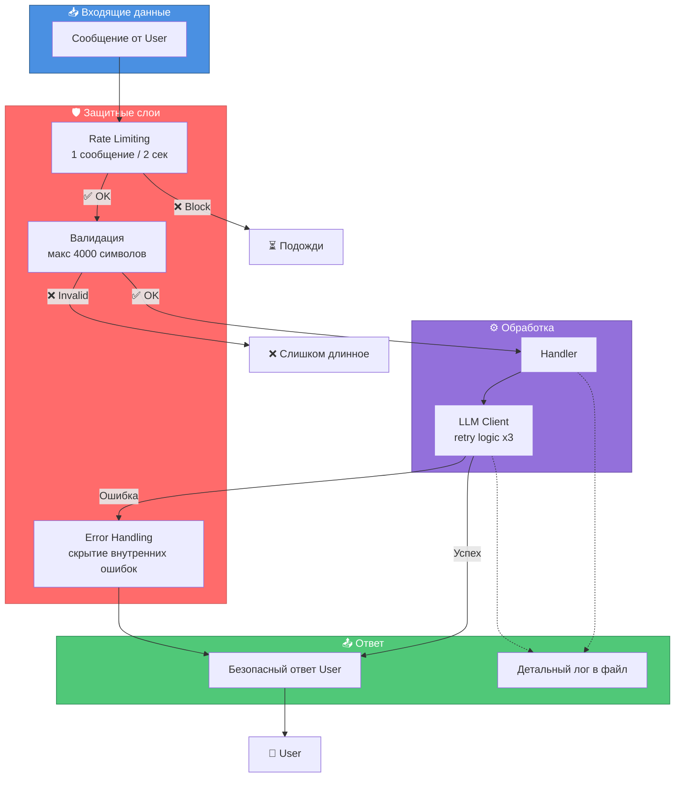
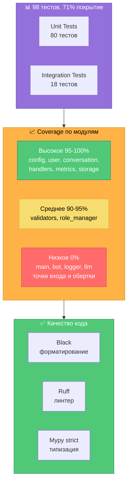
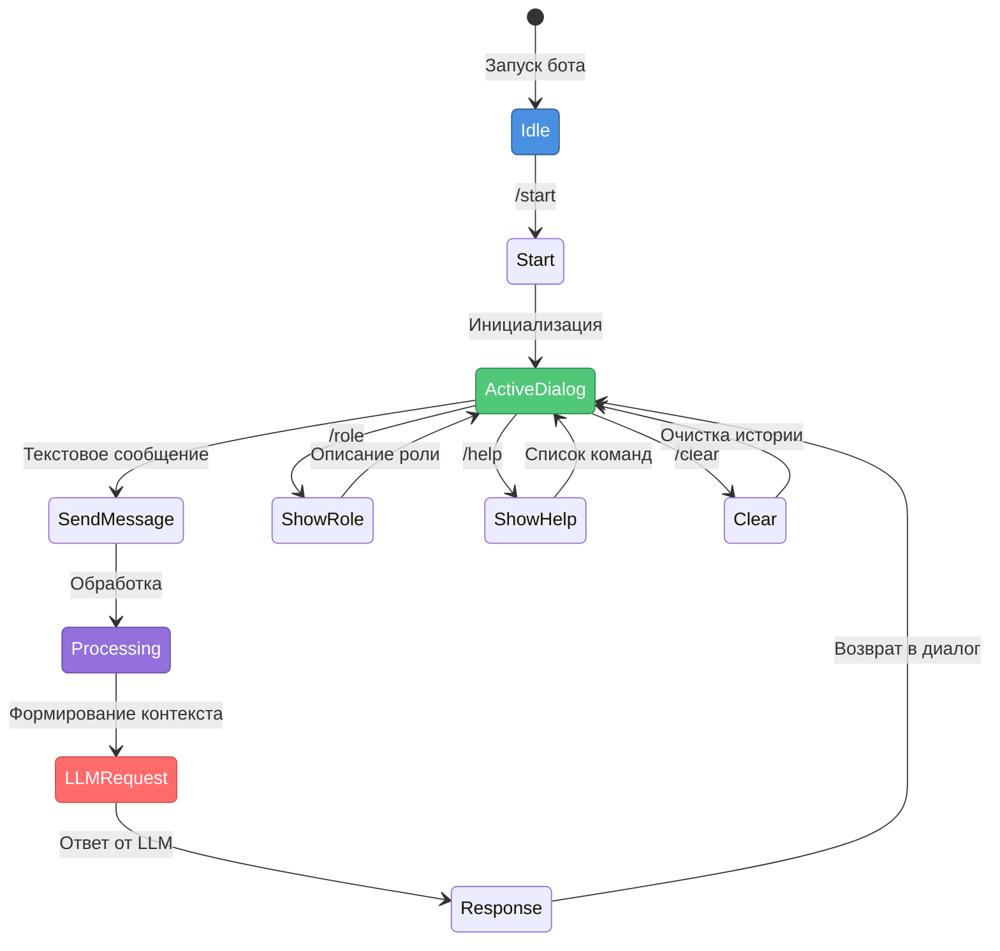
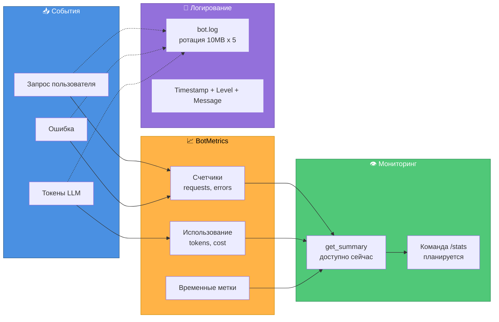
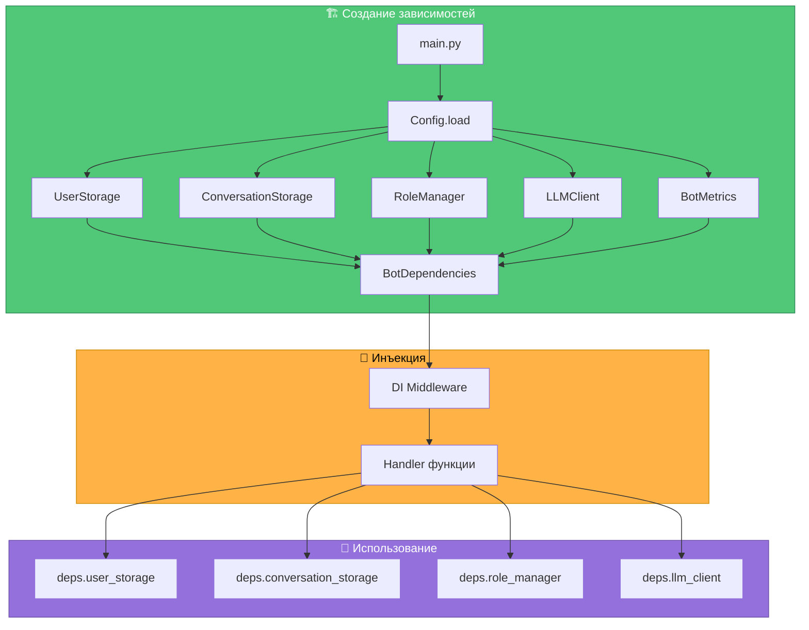
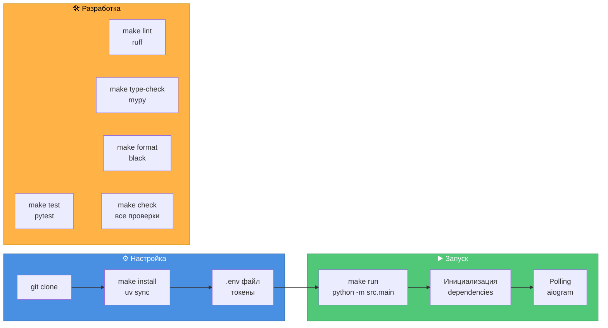

# 🏗️ Обзор архитектуры проекта

> **Текущее состояние:** v2.0 Production Ready | 98 тестов | 71% покрытие

## 📐 Общая архитектура



## 🔄 Поток обработки сообщения

```mermaid
sequenceDiagram
    participant U as 👤 User
    participant B as 🤖 Bot
    participant RL as ⏱️ RateLimit
    participant H as 🎯 Handler
    participant D as 🔧 Deps
    participant C as 💬 Conversation
    participant R as 🎭 RoleManager
    participant L as 🧠 LLMClient
    participant O as 🌐 OpenRouter

    U->>B: Текстовое сообщение
    B->>RL: Проверка rate limit
    alt Слишком частые запросы
        RL-->>B: ❌ Блокировка
        B-->>U: ⏳ Подожди 2 секунды
    else Запрос разрешен
        RL->>H: Передача управления
        H->>D: Получить зависимости
        D->>C: Получить/создать диалог
        C-->>H: Conversation объект
        H->>R: Получить system prompt
        R-->>H: Промпт роли
        H->>C: Добавить сообщение user
        H->>C: Сформировать контекст
        C-->>H: История + system prompt
        H->>L: Отправить в LLM
        L->>O: API запрос
        O-->>L: Ответ от модели
        L-->>H: Текст ответа
        H->>C: Сохранить ответ assistant
        H->>B: Отправить ответ
        B->>U: 💬 Ответ от бота
    end

    style U fill:#4A90E2,stroke:#2E5C8A,color:#fff
    style B fill:#50C878,stroke:#2E8B57,color:#fff
    style RL fill:#FFB347,stroke:#CC8B00,color:#000
    style H fill:#9370DB,stroke:#6A4CA9,color:#fff
    style L fill:#FF6B6B,stroke:#CC5555,color:#fff
    style O fill:#4ECDC4,stroke:#3AA39B,color:#fff
```

## 📦 Компоненты системы

```mermaid
graph LR
    subgraph Core["🎯 Ядро бота"]
        Bot[Bot<br/>aiogram wrapper]
        Config[Config<br/>env vars]
        Main[Main<br/>точка входа]
    end

    subgraph MW["⚙️ Middlewares"]
        RateLimit[RateLimitMiddleware<br/>2 сек между запросами]
        DI[DIMiddleware<br/>инъекция зависимостей]
    end

    subgraph Handlers["🎯 Обработчики"]
        CmdStart[/start]
        CmdClear[/clear]
        CmdRole[/role]
        CmdHelp[/help]
        TextHandler[Текстовые сообщения]
    end

    subgraph Storage["💾 Хранилище In-Memory"]
        UserStorage[UserStorage<br/>LRU + TTL]
        ConvStorage[ConversationStorage<br/>LRU + TTL]
    end

    subgraph Logic["🧠 Бизнес-логика"]
        User[User<br/>dataclass]
        Conversation[Conversation<br/>история диалога]
        RoleManager[RoleManager<br/>управление ролями]
        Validators[Validators<br/>валидация input]
        Metrics[BotMetrics<br/>статистика]
    end

    subgraph External["🌐 Внешние сервисы"]
        LLMClient[LLM Client<br/>retry logic]
        OpenRouter[OpenRouter API<br/>gpt-oss-20b]
    end

    subgraph Files["📁 Файлы"]
        Prompts[prompts/*.txt<br/>системные промпты]
        Logs[logs/bot.log<br/>ротация 10MB]
    end

    Main --> Bot
    Main --> Config
    Bot --> MW
    MW --> Handlers
    Handlers --> Storage
    Handlers --> Logic
    Logic --> External
    RoleManager -.-> Prompts
    Logic -.-> Logs

    style Core fill:#50C878,stroke:#2E8B57,color:#fff
    style MW fill:#FFB347,stroke:#CC8B00,color:#000
    style Handlers fill:#9370DB,stroke:#6A4CA9,color:#fff
    style Storage fill:#4A90E2,stroke:#2E5C8A,color:#fff
    style Logic fill:#E8B4F0,stroke:#B565D8,color:#000
    style External fill:#FF6B6B,stroke:#CC5555,color:#fff
    style Files fill:#F7DC6F,stroke:#D4AF37,color:#000
```

## 🗂️ Структура классов



## 🎭 Управление ролями

```mermaid
graph TB
    subgraph Init["🚀 Инициализация"]
        Start[main.py запуск]
        LoadConfig[Загрузка Config]
        CreateRM[Создание RoleManager]
        ReadFile[Чтение prompts/nutritionist.txt]
    end

    subgraph Usage["💬 Использование"]
        GetPrompt[Handler запрашивает prompt]
        FormContext[Формирование контекста]
        SendLLM[Отправка в LLM]
    end

    subgraph Commands["⌨️ Команды"]
        RoleCmd[/role команда]
        ShowDesc[Показать описание роли]
        HelpCmd[/help команда]
        ShowCmds[Показать команды]
    end

    Start --> LoadConfig
    LoadConfig --> CreateRM
    CreateRM --> ReadFile
    ReadFile -->|Успех| GetPrompt
    ReadFile -->|Ошибка| Exit[❌ Выход с ошибкой]

    GetPrompt --> FormContext
    FormContext --> SendLLM

    RoleCmd --> ShowDesc
    HelpCmd --> ShowCmds

    style Init fill:#50C878,stroke:#2E8B57,color:#fff
    style Usage fill:#9370DB,stroke:#6A4CA9,color:#fff
    style Commands fill:#FFB347,stroke:#CC8B00,color:#000
    style Exit fill:#FF6B6B,stroke:#CC5555,color:#fff
```

## 💾 Управление памятью (LRU + TTL)



## 🔒 Безопасность и защита



## 🧪 Тестирование



## 📋 Команды бота



## 📊 Метрики и мониторинг



## 🎯 Dependency Injection



## 🚀 Деплой и запуск



---

## 📌 Ключевые особенности

| Аспект | Реализация | Статус |
|--------|-----------|--------|
| **Архитектура** | Dependency Injection + Protocol interfaces | ✅ Production |
| **Безопасность** | Rate limiting + валидация + error hiding | ✅ Production |
| **Память** | LRU cache + TTL (макс 1000, 24ч) | ✅ Production |
| **Тестирование** | 98 тестов, 71% покрытие, TDD подход | ✅ Production |
| **Качество кода** | Black + Ruff + Mypy strict | ✅ Production |
| **Мониторинг** | Логирование + метрики | ✅ Production |
| **Роли** | Файловые промпты + RoleManager | ✅ Production |
| **Retry logic** | 3 попытки для LLM API | ✅ Production |

---

## 🔗 Связанные документы

- [vision.md](vision.md) - Техническое видение и принципы
- [tasklist.md](tasklists/tasklist-sp0.md) - План разработки Sprint 0 (все итерации завершены)
- [code_review_summary.md](code_review_summary.md) - Результаты code review
- [ITERATION_5_REPORT.md](../ITERATION_5_REPORT.md) - Отчет о последней итерации
- [presentation.md](../presentation.md) - Презентация проекта


