# 🎨 Визуальный гайд по проекту

> **Systech AIDD Test** - ИИ-Нутрициолог Telegram-бот
>
> Визуализация с разных точек зрения

---

## 🏗️ Точка зрения: Архитектура системы

### Слоистая архитектура (Layered Architecture)

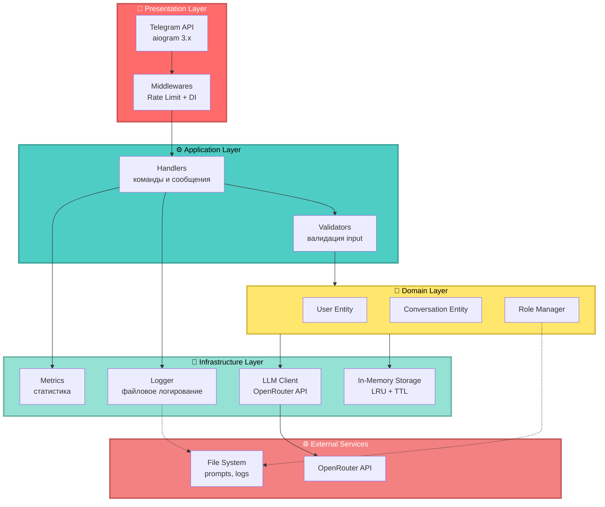

---

## 👤 Точка зрения: User Journey

### Путь пользователя от запуска до получения ответа

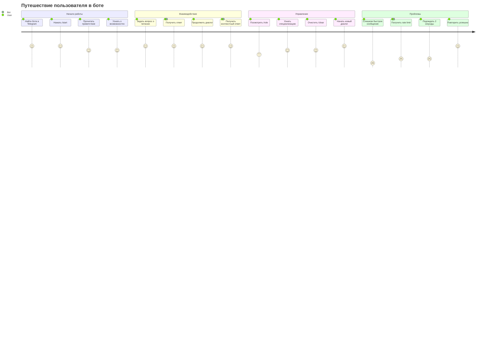

---

## 💻 Точка зрения: Разработчик - Структура кода

### Дерево модулей и их зависимости

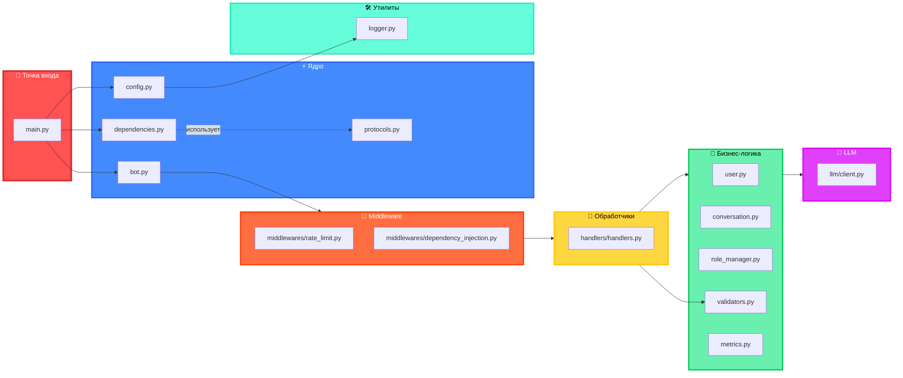

---

## 🔄 Точка зрения: Data Flow

### Как данные проходят через систему

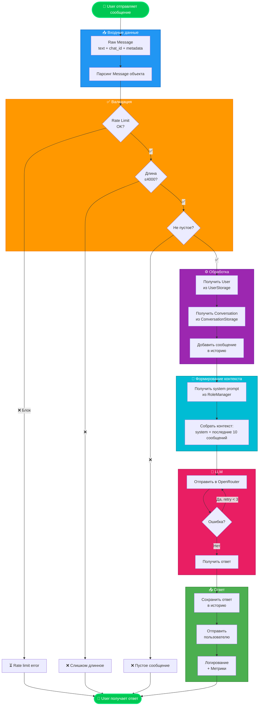

---

## 🛡️ Точка зрения: Безопасность

### Security Flow - Защитные механизмы

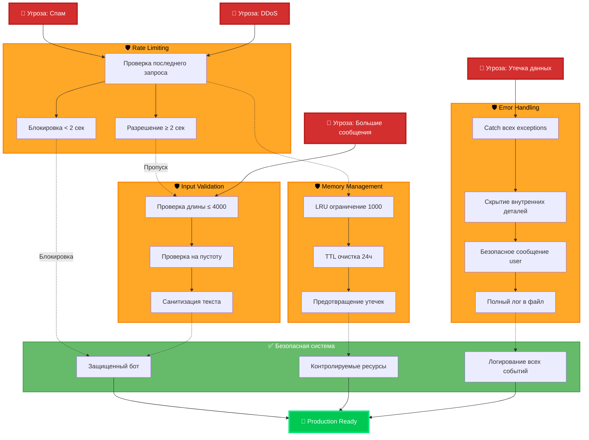

---

## ⚡ Точка зрения: Performance & Memory

### Управление памятью и производительностью

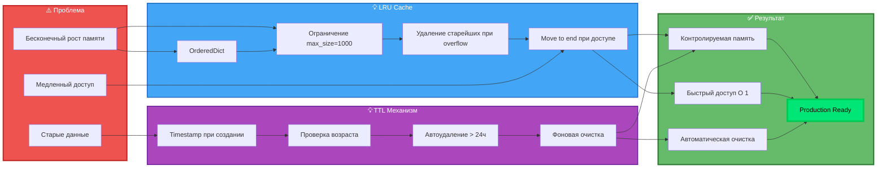

---

## 🎯 Точка зрения: State Management

### Состояния диалога и переходы

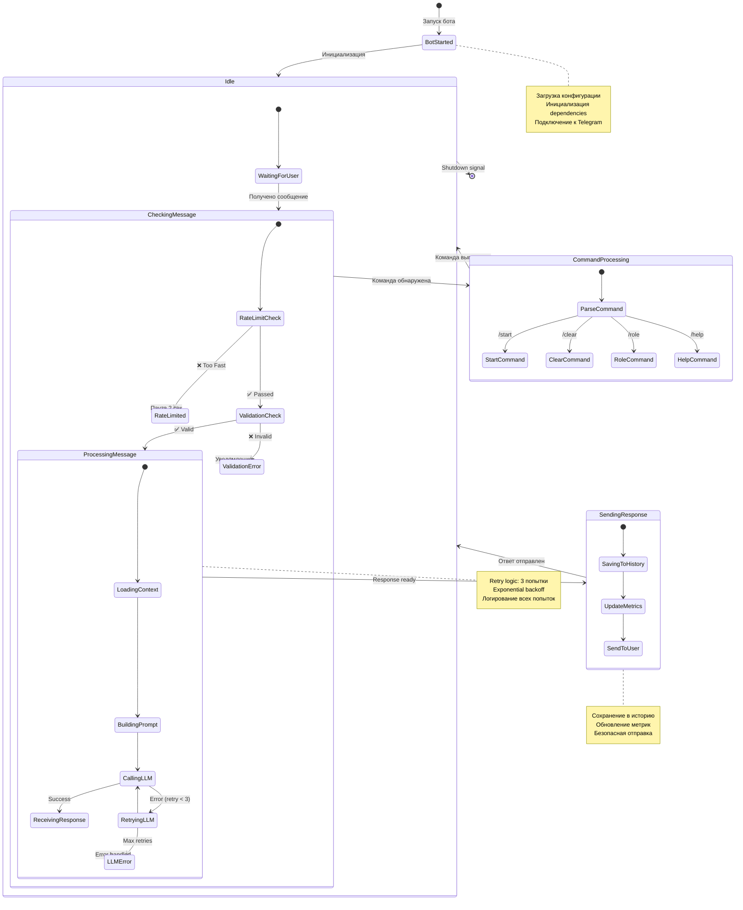

---

## 🔌 Точка зрения: Integration & API

### Взаимодействие с внешними сервисами

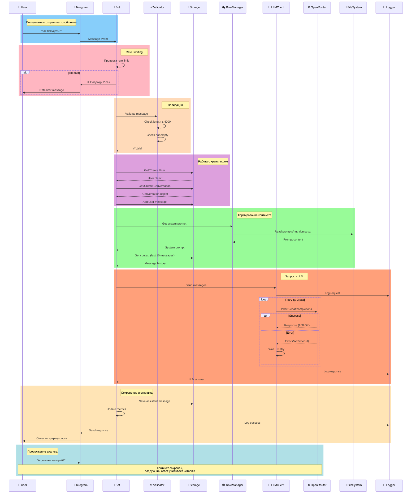

---

## 🏛️ Точка зрения: SOLID Principles

### Применение SOLID принципов в архитектуре

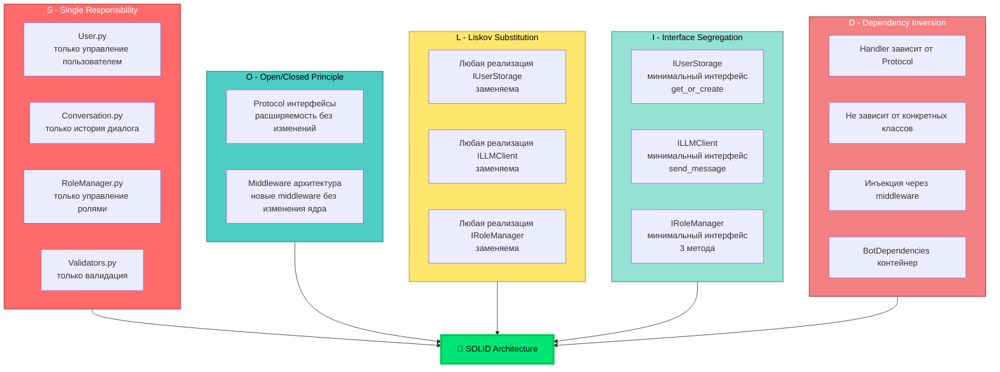

---

## 🧪 Точка зрения: Testing Strategy

### Пирамида тестирования

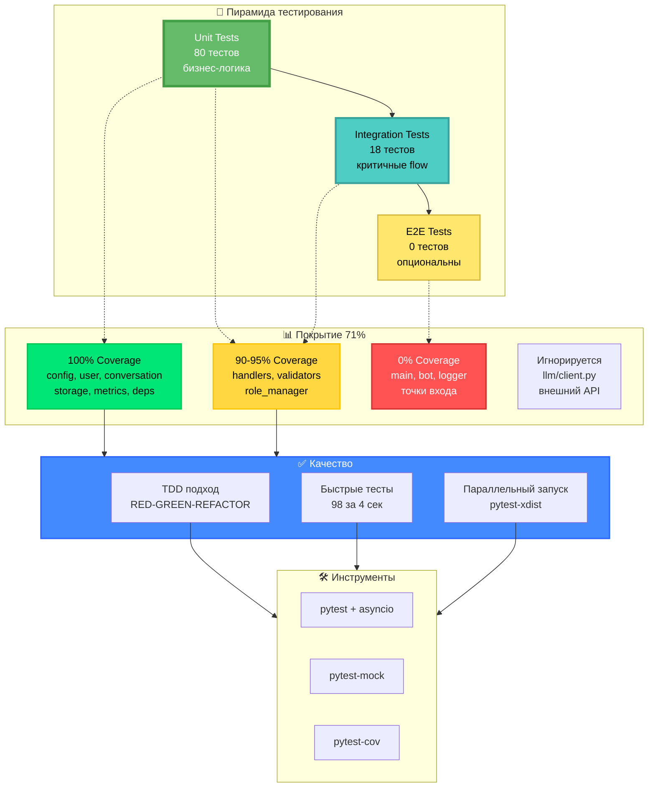

---

## 📦 Точка зрения: Deployment

### От разработки до production

```mermaid
graph LR
    subgraph Dev["💻 Development"]
        Code[Написание кода]
        Format[make format<br/>black]
        Lint[make lint<br/>ruff]
        Type[make type-check<br/>mypy]
        Test[make test<br/>pytest]
    end

    subgraph CI["🔄 CI/CD готовность"]
        Check[make check<br/>все проверки]
        Coverage[coverage ≥ 70%]
        Quality[quality score 8.7/10]
    end

    subgraph Build["🏗️ Build"]
        UV[uv sync]
        Deps[Установка зависимостей]
        Env[Настройка .env]
    end

    subgraph Deploy["🚀 Production"]
        Server[VPS/Cloud сервер]
        Process[Systemd service]
        Monitor[Логирование + метрики]
    end

    Code --> Format
    Format --> Lint
    Lint --> Type
    Type --> Test
    Test --> Check
    Check --> Coverage
    Coverage --> Quality
    Quality --> UV
    UV --> Deps
    Deps --> Env
    Env --> Server
    Server --> Process
    Process --> Monitor

    style Dev fill:#42A5F5,stroke:#1565C0,stroke-width:2px,color:#fff
    style CI fill:#66BB6A,stroke:#2E7D32,stroke-width:2px,color:#fff
    style Build fill:#FFA726,stroke:#F57C00,stroke-width:2px,color:#000
    style Deploy fill:#AB47BC,stroke:#6A1B9A,stroke-width:2px,color:#fff
```

---

## 🌐 Точка зрения: Technology Stack

### Технологический стек с версиями

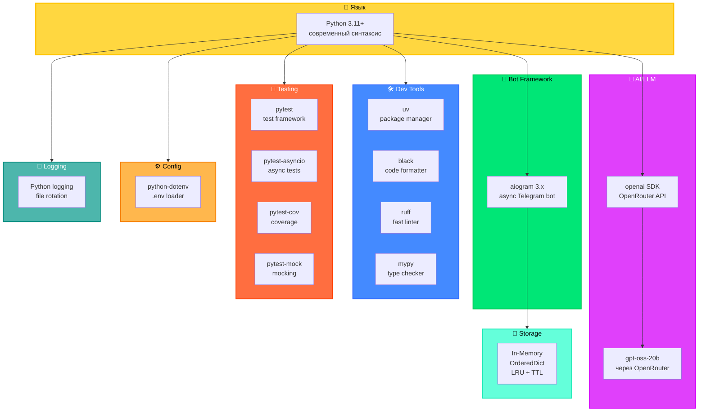

---

## 🎭 Точка зрения: Role System

### Система управления ролями

```mermaid
graph TB
    subgraph FileSystem["📁 Файловая система"]
        PromptsDir[prompts/]
        NutFile[nutritionist.txt]
        FutureRole1[doctor.txt<br/>будущее]
        FutureRole2[trainer.txt<br/>будущее]
    end

    subgraph RoleManager["🎭 RoleManager"]
        Init[__init__<br/>загрузка файла]
        Load[load_system_prompt<br/>чтение из файла]
        Get[get_system_prompt<br/>полный промпт]
        Desc[get_role_description<br/>первые 3 строки]
        Reload[reload_prompt<br/>горячая перезагрузка]
    end

    subgraph Usage["💬 Использование"]
        StartCmd[/start команда<br/>показать роль]
        RoleCmd[/role команда<br/>описание]
        MsgHandler[Message handler<br/>формирование контекста]
    end

    subgraph Context["📝 Контекст LLM"]
        SystemMsg[system: промпт роли]
        UserMsgs[user: сообщения]
        AssistMsgs[assistant: ответы]
        APICall[Отправка в OpenRouter]
    end

    PromptsDir --> NutFile
    NutFile --> Init
    Init --> Load
    Load --> Get
    Load --> Desc
    Get --> Reload

    Get --> MsgHandler
    Desc --> StartCmd
    Desc --> RoleCmd

    MsgHandler --> SystemMsg
    SystemMsg --> UserMsgs
    UserMsgs --> AssistMsgs
    AssistMsgs --> APICall

    style FileSystem fill:#FFE082,stroke:#FFB300,stroke-width:2px,color:#000
    style RoleManager fill:#64B5F6,stroke:#1976D2,stroke-width:2px,color:#fff
    style Usage fill:#81C784,stroke:#388E3C,stroke-width:2px,color:#fff
    style Context fill:#BA68C8,stroke:#7B1FA2,stroke-width:2px,color:#fff
```

---

## 📊 Точка зрения: Metrics & Monitoring

### Система метрик и мониторинга

```mermaid
graph LR
    subgraph Events["📥 События"]
        E1[User запрос]
        E2[LLM вызов]
        E3[Ошибка]
        E4[Токены использованы]
    end

    subgraph Collection["📊 Сбор метрик"]
        M1[total_requests++]
        M2[total_errors++]
        M3[total_tokens += N]
        M4[total_cost += $]
        M5[active_users.add]
        M6[start_time]
    end

    subgraph Calculated["🧮 Вычисляемые"]
        C1[uptime<br/>now - start_time]
        C2[error_rate<br/>errors/requests %]
        C3[avg_tokens<br/>tokens/requests]
        C4[cost_per_request<br/>cost/requests]
    end

    subgraph Storage["💾 Хранение"]
        S1[BotMetrics объект<br/>in-memory]
        S2[Логи в файл<br/>logs/bot.log]
    end

    subgraph Output["📤 Вывод"]
        O1[get_summary<br/>dict]
        O2[get_stats_formatted<br/>строка]
        O3[/stats команда<br/>планируется]
    end

    E1 --> M1
    E2 --> M1
    E2 --> M3
    E2 --> M4
    E3 --> M2
    E1 --> M5

    M1 --> C1
    M1 --> C2
    M2 --> C2
    M3 --> C3
    M4 --> C4
    M6 --> C1

    M1 --> S1
    M2 --> S1
    M3 --> S1
    M4 --> S1
    M5 --> S1

    S1 --> O1
    S1 --> O2
    O1 --> O3
    O2 --> O3

    S1 -.-> S2

    style Events fill:#42A5F5,stroke:#1565C0,stroke-width:2px,color:#fff
    style Collection fill:#66BB6A,stroke:#2E7D32,stroke-width:2px,color:#fff
    style Calculated fill:#FFA726,stroke:#F57C00,stroke-width:2px,color:#000
    style Storage fill:#AB47BC,stroke:#6A1B9A,stroke-width:2px,color:#fff
    style Output fill:#26C6DA,stroke:#00838F,stroke-width:2px,color:#fff
```

---

## 🔄 Точка зрения: Lifecycle

### Жизненный цикл приложения

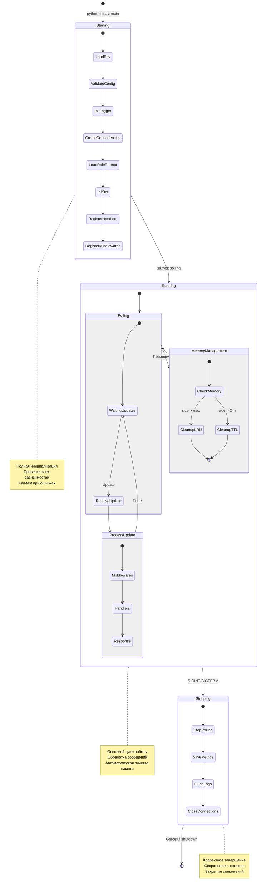

---

## 🎨 Точка зрения: Design Patterns

### Используемые паттерны проектирования

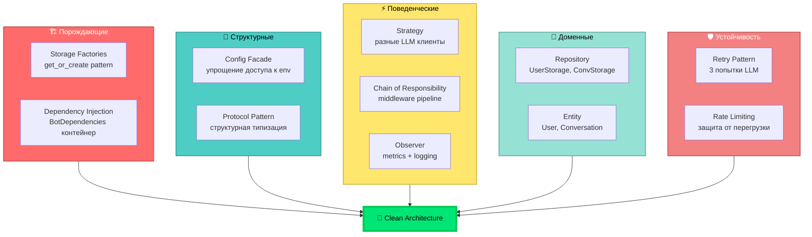

---

## 🎯 Точка зрения: Core Features

### Ключевые возможности системы

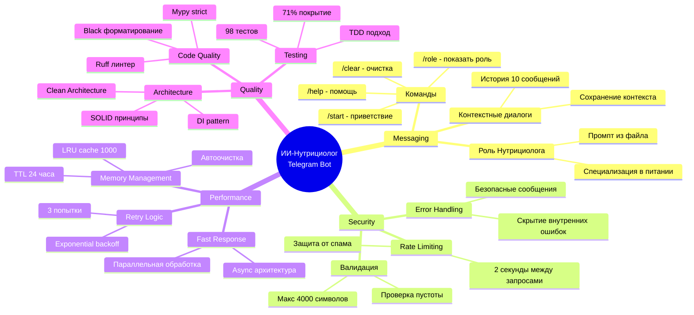

---

## 📈 Точка зрения: Project Metrics

### Метрики проекта

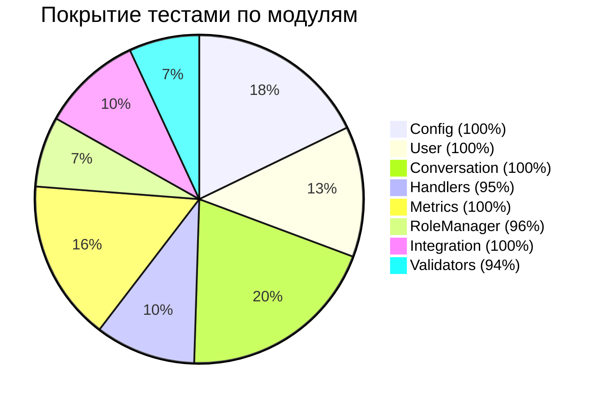

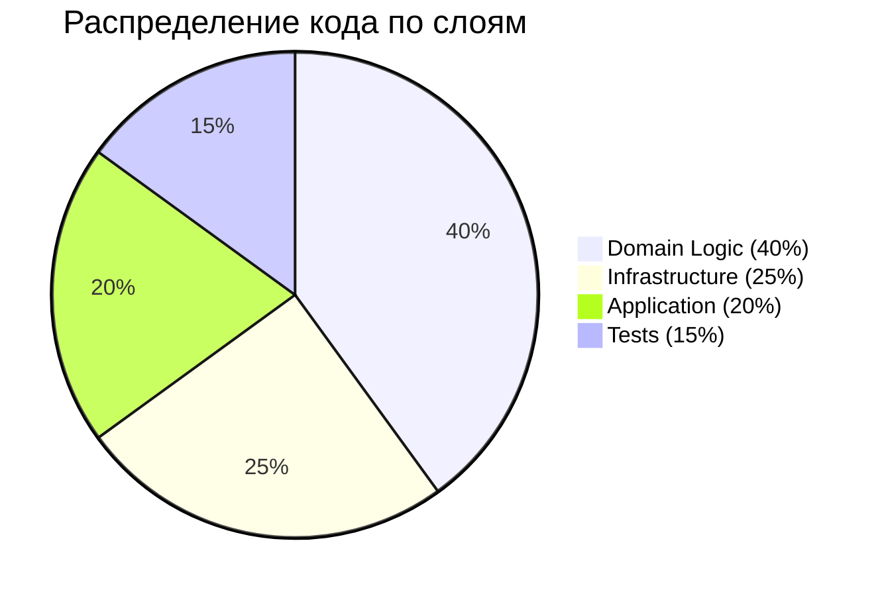

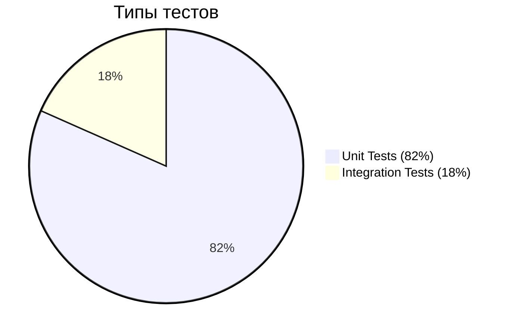

---

## 🚀 Точка зрения: Production Readiness

### Готовность к production

```mermaid
graph LR
    subgraph Functionality["✅ Функциональность"]
        F1[Все команды работают]
        F2[LLM интеграция]
        F3[Управление контекстом]
        F4[Роль Нутрициолога]
    end

    subgraph Security["🔒 Безопасность"]
        S1[Rate limiting ✓]
        S2[Input validation ✓]
        S3[Error hiding ✓]
        S4[No data leaks ✓]
    end

    subgraph Performance["⚡ Производительность"]
        P1[LRU cache ✓]
        P2[TTL cleanup ✓]
        P3[Memory limits ✓]
        P4[Fast response ✓]
    end

    subgraph Reliability["🛡️ Надежность"]
        R1[Retry logic ✓]
        R2[Graceful shutdown ✓]
        R3[Error recovery ✓]
        R4[Logging ✓]
    end

    subgraph Quality["✨ Качество"]
        Q1[98 тестов ✓]
        Q2[71% coverage ✓]
        Q3[Type safety ✓]
        Q4[Clean code ✓]
    end

    subgraph Monitoring["📊 Мониторинг"]
        M1[Метрики ✓]
        M2[Логирование ✓]
        M3[Error tracking ✓]
        M4[Usage stats ✓]
    end

    Production[🎉 PRODUCTION READY<br/>v2.0<br/>Quality Score: 8.7/10]

    Functionality --> Production
    Security --> Production
    Performance --> Production
    Reliability --> Production
    Quality --> Production
    Monitoring --> Production

    style Functionality fill:#66BB6A,stroke:#2E7D32,stroke-width:2px,color:#fff
    style Security fill:#42A5F5,stroke:#1565C0,stroke-width:2px,color:#fff
    style Performance fill:#FFA726,stroke:#F57C00,stroke-width:2px,color:#000
    style Reliability fill:#AB47BC,stroke:#6A1B9A,stroke-width:2px,color:#fff
    style Quality fill:#26C6DA,stroke:#00838F,stroke-width:2px,color:#fff
    style Monitoring fill:#EF5350,stroke:#C62828,stroke-width:2px,color:#fff
    style Production fill:#00E676,stroke:#00C853,stroke-width:5px,color:#000
```

---

## 🎓 Заключение

Этот визуальный гайд представляет проект **Systech AIDD Test** с 12+ различных точек зрения:

1. ✅ **Архитектура** - слоистая структура
2. ✅ **User Journey** - путь пользователя
3. ✅ **Код** - структура модулей
4. ✅ **Data Flow** - поток данных
5. ✅ **Безопасность** - защитные механизмы
6. ✅ **Performance** - управление памятью
7. ✅ **State** - состояния и переходы
8. ✅ **Integration** - API взаимодействия
9. ✅ **SOLID** - принципы проектирования
10. ✅ **Testing** - стратегия тестирования
11. ✅ **Deployment** - процесс развертывания
12. ✅ **Tech Stack** - технологии
13. ✅ **Roles** - система ролей
14. ✅ **Metrics** - мониторинг
15. ✅ **Lifecycle** - жизненный цикл
16. ✅ **Patterns** - паттерны проектирования
17. ✅ **Features** - ключевые возможности
18. ✅ **Metrics** - метрики проекта
19. ✅ **Production** - готовность к продакшену

**Текущее состояние:** Production Ready v2.0 | 98 тестов | 71% покрытие | Quality 8.7/10


